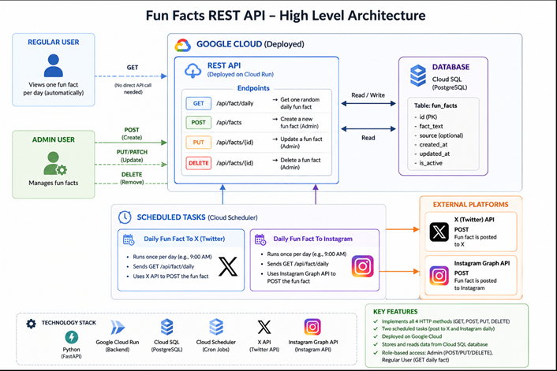

# Fun Facts Posted Daily

## Group Project Requirements

Fun Facts Posted Daily is an account dedicated to posting one random fun fact a day. Each fun fact will not repeat itself, ensuring that any information posted is new. The team working on this project will ensure this by keeping the database clean and updated. Fun facts are to be posted at a set time each day, keeping a consistent schedule for followers to look forward to. The main goal of this account is to provide interesting fun facts to spark curiosity in those following the page. A problem that could occur is when a fact is not deleted and is kept in the database. This can be an issue for a multitude of reasons. If it is a fact that is posted again, viewers will become bored and may leave the page. It will also make the database messier for the team to look through. The stakeholders for this account are the members of the team developing and managing the project. Because they are directly responsible for its creation and maintenance, they have a strong interest in its success and are invested in resolving any issues or challenges that may arise throughout the project's development and operation.

The requirements for the project were identified by first brainstorming what was needed. A database will be needed to store each fact with an ID to identify each one that is placed in the database. An account will need to be created for the facts to be posted on. Commands were also thought of telling the database what to do with the information. Such commands as adding, deleting, or getting a fact. Two Cockburn templates were made to put our ideas into a neater display.

## Cockburn template 1

| Section | Details |
|---|---|
| Goal in Context | Every day at the same set time a random fun fact is posted to a social media site. Teach something new each day. |
| Scope | A social media app. |
| Level | User Goal |
| Precondition | The database of fun facts must have at least one fact. |
| Success End Condition | A random fun fact is posted once a day. |
| Failed End Condition | There will not be a post uploaded that day. |
| Primary Actor | The creator of the account. |
| Trigger | The first post that was made. |
| Main Success Scenario | 1. Creator logs in 2. Schedule a post 3. Random fun fact is picked 4. Fun fact is posted at set time. |
| Extensions | 5a. Old fun fact, fun fact is deleted and new one is picked. |
| Variations | Login via mobile or website |
| Related Information | Low Priority, performance, frequent use, web or mobile channels |
| Schedule | Jan 23rd |
| Open Issues | None |

## Cockburn template 2

| Section | Details |
|---|---|
| Goal in Context | The administrator deletes an old or duplicate fun fact from the database to ensure content uniqueness. |
| Scope | Fun Facts Posted Daily Database/Backend System. |
| Level | User Goal |
| Precondition | The administrator is logged into the backend system, and the database contains facts. |
| Success End Condition | The specified fun fact is successfully removed from the database, preventing it from being posted again. |
| Failed End Condition | The fact is not deleted, and the database remains unchanged. |
| Primary Actor | System Administrator / Creator |
| Trigger | Administrator identifies a duplicate or low-quality fact that needs removal. |
| Main Success Scenario | 1. Administrator logs into the database management console. 2. Administrator searches for the specific fact ID or text. 3. Administrator selects the "Delete" command. 4. System confirms the deletion and updates the database. |
| Extensions | 3a. Fact ID not found, system displays an error message and prompts for a retry. |
| Variations | Delete via command-line interface (CLI) or graphic database UI |
| Related Information | High priority for database cleanliness; executed as maintenance. |
| Schedule | Jan 24th |
| Open Issues | Need to ensure deleting a fact doesn't break automated numbering sequences. |

## Validation

To ensure that the requirements identified for the "Fun Facts Posted Daily" project are accurate, complete, and verifiable, a multi-step validation process will be implemented.

First, user story testing and walkthroughs will be conducted using the finalized Cockburn use case templates to trace every user action back to a specific functional requirement, ensuring no logical gaps exist in the scheduling or deletion processes.

Second, a traceability matrix will be constructed to map each requirement directly to its technical implementation, such as database queries for adding, retrieving, and deleting facts. Finally, functional prototype testing will be conducted in a staging environment to validate that the automation triggers execute exactly once per day and that duplicate entries are accurately rejected or purged without disrupting the production queue.

